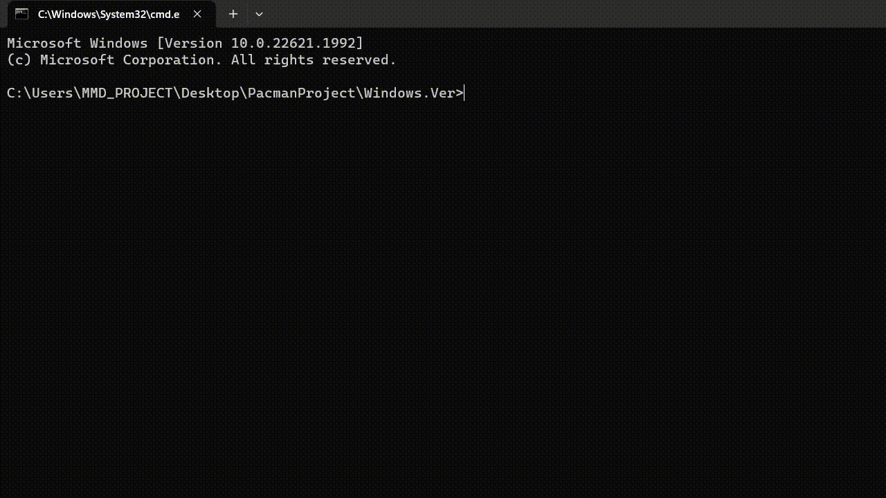

# The God We Trust

# Pacman Project

## [Mohammad Hossein Basouli](https://github.com/MMDPROJECT), [Mohamad Ghaderi](https://github.com/MohammadGhaderi83)

## Introduction:

- #### Briefly describe the project:

  - This CLI App simulates [**Pacman Game**](https://en.wikipedia.org/wiki/Pac-Man) which was so popular and cool once with many other extra features like saving, random map generation and so on.

- #### Objectives of the project:

  - This app provides separate versions both for linux and windows.
  - The app should provide a beautiful and user-friendly interface for user to interact with the game.
  - It has to generate a random map for playing
  - Also it has to randomly spawn some fruits in the map based on the map size to help the player play the game easier.
  - The game should have saving & loading feature
  - And anything else you can except from a CLI Pacman :).

- #### Provide a high-level overview of the approach taken to complete the project:

  1. Figure out an algorithm to generate the map.
  2. Design structs.
  3. Place the objects on the map.
  4. Linking functionalities and I/O of player.
  5. Save & Load.
  6. Score board.
  7. Debugging.

  

## Design and Implementation:

- #### Describe the design of the solution, including any algorithms or data structures used:

  - Random **Map** Generation:
    - My teammate and me had put so much effort on this part because that had so many complexities in itself.
  - Connecting **Tunnels**:
    - The approach we have used to generate a random map is to first partition the map into 9 parts and then dig some tunnels through them and then intersect those ways to make sure that they will connect some where.
  - **Devils** house & **Pacman**:
    - After that we have to create the devils house and then put them in there as well as putting pacman in it's place.
    - Then we have to connect the tunnels to the pacman and devils house to make sure that they can move through the tunnels.
    - Last not least is to randomly move the devils.

- #### Programming language:

  - C++

  

## Testing and Evaluation:

- Below shows a comprehensive test of all options of the app and:

